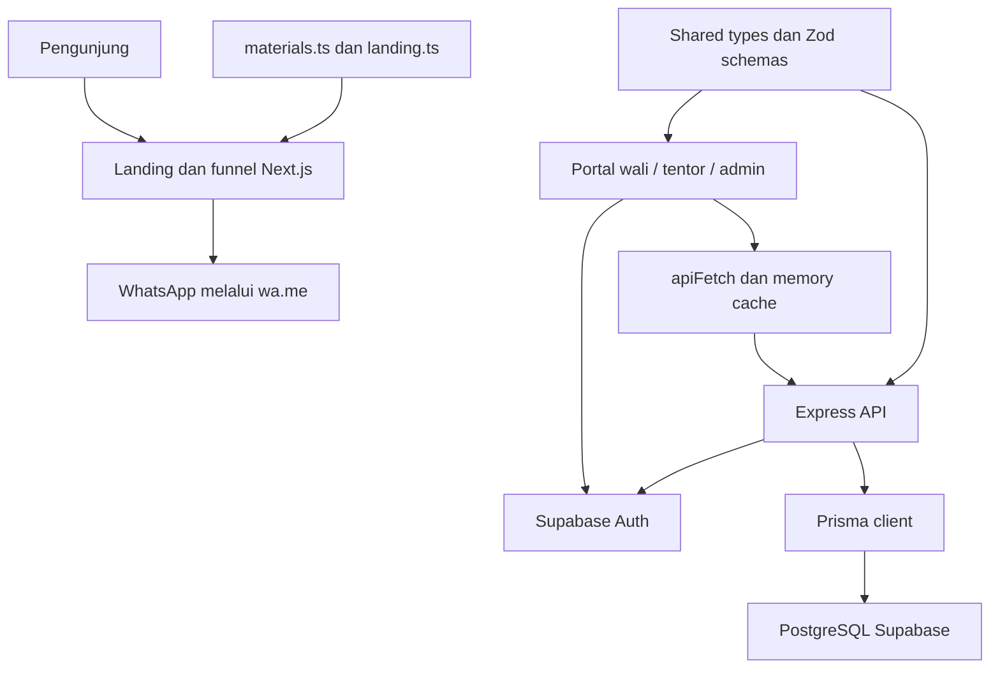

# Codebase Overview — Nurman Course

Referensi arsitektur implementasi saat ini: funnel pendaftaran WhatsApp dan portal operasional les untuk wali, tentor, serta admin. Dokumen ini bukan checklist pekerjaan, log hasil pengujian, atau bukti kondisi server produksi.

## 1. Hierarki sumber dan cara membaca

Markdown root tetap menjadi patokan awal; klaim implementasi yang bertentangan diverifikasi terhadap source/config, bukan disalin sebagai fakta baru.

| Sumber | Peran |
|---|---|
| [AGENTS.md](../AGENTS.md) | Aturan kerja, batas scope, dan tanggung jawab funnel/pricing. |
| [SYSTEM_MAP.md](../SYSTEM_MAP.md) | Peta navigasi dan lokasi kode; beberapa rincian masih tertinggal. |
| [README.md](../README.md) | Pintu masuk repo; masih boilerplate, bukan panduan monorepo lengkap. |
| [design.md](../design.md) | Referensi desain root; konflik dengan penerapan visual terbaru dijelaskan di bawah. |
| [ROADMAP-LMS.md](./ROADMAP-LMS.md) | Visi, batas produk, dan fase; rencana tidak membuktikan fitur sudah ada. |
| [flow-system.md](./flow-system.md) / [erd-lms.md](./erd-lms.md) | Referensi alur bisnis / model data; detail aktual mengikuti handler dan Prisma schema. |
| [tasks/todo.md](../tasks/todo.md) / [tasks/plan.md](../tasks/plan.md) | Checklist eksekusi / rencana rinci dan approval gates. |
| [PROGRESS.md](./PROGRESS.md) | Keputusan, riwayat perubahan, bukti verifikasi, dan residual; tidak diduplikasi di sini. |

### Konflik dokumentasi yang perlu diketahui

| Sumber | Konflik dan pembacaan yang benar |
|---|---|
| `AGENTS.md` | Bagian akhir menyatakan tidak ada backend/DB/auth/LMS, bertentangan dengan overview root dan kode Express/Prisma/portal. Pernyataan itu baseline lama, bukan keadaan seluruh aplikasi sekarang. |
| `README.md` | Path `app/page.tsx`, uraian Geist, dan saran Vercel berasal dari template. App berada di `frontend/app`; layout mendaftarkan Geist, Geist Mono, Playfair Display, dan DM Sans. Tidak semua permukaan memakai font yang sama. |
| `design.md` | Latar solid blue/Geist/glassmorphism tidak menggambarkan seluruh UI. Token AppVerse sudah warm; layout wali memakai frame `max-w-md`, canvas `#F0ECE1` dan isi `#F7F4EF`, sesuai keputusan warm mobile di progress. Ini catatan konflik, bukan keputusan desain baru. |
| `SYSTEM_MAP.md` | `/app/materi` adalah redirect ke `/app/program`, bukan katalog terpisah. `/app/admin/pengguna` belum memiliki `page.tsx`. Peta client backend/cache juga perlu dibaca bersama modul terbaru di bawah. |
| Roadmap dan catatan historis | Klaim frontend-only, demo mode, stack kandidat, atau A/B belum final tidak boleh menggantikan source sekarang. Blok NC pada task memilih Opsi A, tetapi Course/Entitlement dan route publik barunya belum diimplementasikan. |

## 2. Arsitektur dan dependency utama

Monorepo menggunakan npm workspaces (`frontend`, `backend`, `packages/*`) dan Turborepo. Funnel tetap memakai data statis; data operasional portal melewati Express dan Prisma. Keduanya tidak otomatis berbagi katalog.



| Layer | Dependency yang tercatat |
|---|---|
| Frontend | Next.js dan `eslint-config-next` **16.3.5**; React/React DOM **19.2.4**; Tailwind CSS dan PostCSS plugin **^4**. |
| UI | Framer Motion `^12.43.0`, Lucide React `^1.11.0`; komponen lokal di `frontend/components/`. |
| Auth client | Frontend: `@supabase/ssr ^0.12.4`, `@supabase/supabase-js ^2.111.0`; backend mendeklarasikan SDK `^2.45.0`. |
| Backend | Express **4.22.3**, Morgan **1.12.0**, Helmet **8.3.0**, express-rate-limit **8.7.0**, TypeScript, ts-node, cors, dotenv. Output TypeScript tetap CommonJS. |
| Database | Prisma/client manifest `^5.18.0`, resolved **5.22.0** pada lockfile root; datasource `postgresql`. |
| Shared | `@nurman-course/shared`: tipe, schema Zod `^3.23.8`, dan `normalizePhone`; entrypoint masih `src/index.ts`. |
| Tooling | Turbo `^2.0.4`, ESLint `^9`; backend Vitest **4.1.11**, Supertest **7.1.4**, serta Node test runner. |

Angka berawalan `^` adalah range manifest, bukan klaim versi terpasang. Acuan: [root manifest](../package.json), [frontend manifest](../frontend/package.json), [backend manifest](../backend/package.json), [shared manifest](../packages/shared/package.json), dan [lockfile root](../package-lock.json).

## 3. Peta modul dan tanggung jawab

| Lokasi | Tanggung jawab / interface penting |
|---|---|
| `frontend/app/` | Route publik, `/login`, serta portal `/app`; login berada di `app/login`, bukan `(auth)/login`. |
| `frontend/app/course/config/CourseConfigClient.tsx` | State konfigurasi lokal, estimasi harga funnel, dan pembentukan URL WhatsApp. Jangan menduplikasi kalkulasi harga di page lain. |
| `frontend/data/materials.ts` | Katalog funnel; `getMaterialById`, `getMaterialsByCategory`, `getLevelBasePrice`. Bukan model `MaterialItem` database. |
| `frontend/data/landing.ts`, `frontend/data/lms.ts` | Konten marketing statis / tipe dan helper tampilan portal; bukan database pengganti. |
| `frontend/lib/api.ts` | `apiFetch<T>(path, options): Promise<T>`, `buildQuery`, GET cache, invalidation, dan subscription log. |
| `frontend/lib/supabase/`, `frontend/middleware.ts` | Client/session Supabase dan redirect akses portal berdasarkan metadata role. |
| `frontend/components/ui/DebugBar.tsx` | Log request development melalui `useSyncExternalStore`, snapshot stabil, clear/copy log. |
| `frontend/hooks/useClock.ts` | `useClock(intervalMs = 60000)` mengembalikan timestamp atau `null` awal; interval/focus/visibility dibersihkan saat unmount. |
| `frontend/components/ui/ProofModal.tsx` | Modal bukti; export `ProofImage` membaca dimensi natural sebelum merender Next Image `unoptimized`. PDF memakai jalur blob terpisah. |
| `frontend/components/course/`, `frontend/components/landing/` | Section funnel/marketing; reusable UI berada di `components/ui/`. |
| `frontend/app/layout.tsx`, `frontend/app/globals.css` | Registrasi font, DebugBar, CSS global, dan token AppVerse; bukan bukti semua halaman sudah seragam. |
| `frontend/utils/format.ts`, `frontend/lib/constants.ts` | Helper format dan konstanta seperti `WHATSAPP_NUMBER`. |
| `backend/src/index.ts` | Registrasi/mount handler Express, export `app` serta re-export `prisma`; domain content legacy dan authoring sudah dimount dari router terpisah, sementara domain operasional lain masih inline. |
| `backend/src/lib/prisma.ts` | Instance Prisma module-cached, dotenv sebelum konstruksi, log SQL/durasi pada nonproduction. Tidak mengimpor entrypoint Express. |
| `backend/src/lib/supabase-admin.ts` | Client service-role khusus backend; `null` bila konfigurasi tidak tersedia, session refresh/persistence dimatikan. Tidak mengimpor entrypoint. |
| `backend/src/middleware/auth.ts` | `requireAuth` (verified ID → role/active DB), `validateAccountAccess` (dipakai middleware/profil), `requireRole(...roles)` allowlist, `requireAdmin = requireRole("admin")`, dan `AuthenticatedRequest`. |
| `backend/src/middleware/http-security.ts` | `readHttpSecurityConfig(env)` memvalidasi origin/kuota `HTTP_*`, `installHttpSecurity(app, config)` memasang log ringkas, Helmet, penolakan Origin, CORS allowlist, limiter, dan `express.json`; `httpErrorHandler` menyeragamkan error parser/URL/tak terduga. |
| `backend/src/routes/content/` | Router legacy untuk public Program dan admin Program/RoadmapStep/MaterialItem; diekstrak bertahap dari `index.ts` dengan kontrak lama dipertahankan. |
| `backend/src/routes/authoring/` | API additive `/api/authoring/*` untuk Course/Section/Lesson, ownership admin/tentor, draft/publish, reorder, serta validasi link internal; belum dipakai frontend. |
| `backend/prisma/backfill-content.ts` | Backfill offline/dry-run/idempoten dari Program/RoadmapStep/MaterialItem ke Course/Section/Lesson; tidak menjalankan otomatis dan tidak boleh diarahkan ke production. |
| `backend/prisma/` | Schema, migration history, dan seed; generated client ada di `backend/src/generated/client`, bukan source untuk diedit. |
| `packages/shared/src/index.ts` | Kontrak input domain dan tipe/status bersama. Import shared tidak menjamin setiap payload UI sudah sesuai schema. |

Startup backend hanya dipanggil saat `require.main === module`: koneksi Prisma lalu listener `127.0.0.1`, port dari `PORT` atau `5000`. Mengimpor `app` tidak menjalankan startup listener; client tetap dikonstruksi saat import.

## 4. Route yang tersedia

Daftar ini mengikuti `frontend/app/**/page.tsx`, bukan angka static generation. Angka “35 static pages” pada log build tidak berarti “35 route”. Route group `(wali)` adalah pengelompokan folder dan **tidak masuk URL**.

| Area | URL aktual dan fungsi |
|---|---|
| Entry / marketing | `/` redirect ke `/landing`; `/landing` adalah marketing, `/course` adalah entry funnel. |
| Pilih program | `/course/program`, `/course/materi`, `/course/jenjang`, `/course/calistung`. |
| Detail / konfigurasi | `/course/materi/[id]`, `/course/config`. |
| Login / selector | `/login`; `/app` berisi selector portal, tetapi middleware mengalihkan wali/tentor ke area masing-masing. |
| Wali: ringkasan | `/app/dashboard`, `/app/jadwal`, `/app/laporan`, `/app/profile`. |
| Wali: program / tagihan | `/app/program`, `/app/program/[slug]`, `/app/tagihan`. |
| Alias materi | `/app/materi` redirect ke `/app/program`; file berada di luar group `(wali)`. |
| Tentor: entry | `/app/tentor` redirect ke `/app/tentor/dashboard`. |
| Tentor: operasional | `/app/tentor/dashboard`, `/app/tentor/jadwal`, `/app/tentor/laporan-harian`, `/app/tentor/laporan-perkembangan`, `/app/tentor/profil`. |
| Admin: ringkasan / orang | `/app/admin`, `/app/admin/murid`, `/app/admin/tentor`. |
| Admin: pembelajaran | `/app/admin/program`, `/app/admin/enrollment`, `/app/admin/roadmap`, `/app/admin/jadwal`. |
| Admin: pembayaran | `/app/admin/tagihan`, `/app/admin/tagihan/[invoiceId]`, `/app/admin/rekening`. |

`/kelas`, `/materi/[slug]`, dan portal member baru masih rencana NC. Jangan menyamakannya dengan `/course/materi/[id]` atau `/app/program/[slug]` yang sudah ada.

## 5. Alur aplikasi dan batas API

- **Funnel:** data `materials.ts` → pilih kategori/item/level → query `materi`, `level`, `program` → konfigurasi lokal → estimasi per anak per minggu → `wa.me`. Ini bukan checkout, pembuatan akun, atau penjadwalan database otomatis.
- **Login:** email/password langsung ke Supabase; nomor WhatsApp lebih dahulu di-resolve ke email melalui API. Akun tanpa email asli dapat memakai placeholder `@nurmancourse.local`; login page tidak menyediakan signup member.
- **Operasional:** admin mengelola akun, murid, program, enrollment, roadmap/materi, sesi, rekening, dan invoice. Tentor mengelola sesi/laporan; wali membaca data anak, program, jadwal, laporan, serta tagihan.
- **Pembayaran:** backend menerima bukti transfer untuk invoice milik wali (`unpaid` → `waiting`), lalu admin memverifikasi menjadi `paid` atau mengembalikan ke `unpaid`. Prabayar memakai entitas tersendiri; tidak ada payment gateway otomatis. Batas integrasi UI dijelaskan di §8.
- **Client state:** `apiFetch` menambahkan Bearer token dari session browser. GET cache berumur satu jam dan berkunci path; `bypassCache` melewati baca/tulis cache. Request non-GET menginvalidasi kategori path sebelum fetch, bukan sinkronisasi realtime lintas pengguna.
- **Waktu / debug:** jadwal memakai clock default satu menit, dashboard tentor satu detik; perubahan status berbasis waktu dapat menunggu interval. Log request hanya development; SQL logging backend nonproduction. Cache dan log ini melengkapi local state, bukan berarti seluruh aplikasi “tanpa shared state”.

Ringkasan boundary di [handler Express](../backend/src/index.ts), bukan kontrak lengkap seluruh endpoint:

| Kelompok endpoint | Akses dan bentuk penggunaan |
|---|---|
| `GET /api/health`, `POST /api/auth/resolve-phone` | Tanpa `requireAuth`; health dan pemetaan nomor login. |
| `GET /api/programs`, `GET /api/programs/:id` | Publik; respons `{ programs }` / `{ program }`, termasuk roadmap legacy dan `bodyText` saat ini. Ini legacy behavior yang menjadi release blocker NC-3.4 sebelum konten Course/Lesson publik diluncurkan. |
| `GET /api/users/me`, `/api/me/*` | `requireAuth`; profil dan data operasional dengan pemeriksaan role/ownership per handler. |
| `POST /api/daily-reports`, `POST /api/progress-reports`; mutasi `/api/me/sessions` | Terautentikasi dengan pembatasan tentor di handler. |
| `/api/admin/*` | `requireAuth` dan `requireAdmin`; operasi domain tidak semuanya mempunyai set CRUD yang identik. |
| `/api/authoring/*` | `requireAuth` + role `admin/tentor`; admin melihat seluruh Course, tentor hanya author miliknya. Course hasil migrasi dengan `programId` terisi read-only sampai frontend cutover; status publish/draft memakai endpoint aksi. |
| `GET /api/payment-accounts` | Memerlukan `requireAuth`, meskipun bukan route berprefiks admin. |

Respons belum seragam: endpoint lama memakai `{ user }`, `{ sessions }`, dan sejenisnya; banyak endpoint admin memakai `{ data }`. Error dapat berupa `{ error: "..." }` atau `{ error: { code, message, details } }`; `apiFetch` menangani kedua bentuk. Jangan mengasumsikan satu envelope global.

**Hardening HTTP NC-1.5 (implementasi lokal, bukan bukti deployment).** Seluruh request melewati `installHttpSecurity` sebelum handler: Helmet, penolakan `Origin` tidak dikenal `403 ORIGIN_NOT_ALLOWED`, CORS allowlist tanpa credentials, limiter `/api` dan `/api/auth/resolve-phone` dengan `429 RATE_LIMITED`, serta `express.json` yang **tetap memakai batas default 100kb**. Default origin development adalah `http://localhost:3000`; production memerlukan `HTTP_ALLOWED_ORIGINS` HTTPS eksplisit dan gagal di awal bila kosong. Kuota berasal dari `HTTP_RATE_LIMIT_*`/`HTTP_AUTH_RATE_LIMIT_*` dengan default 300/menit dan 10/15 menit, memakai memory store **per proses**, bukan kuota global multi-instance. `trust proxy` tetap `false` sesuai keputusan akses langsung; header forwarding tidak dipercaya. `httpErrorHandler` mengembalikan `400 INVALID_JSON`, `413 PAYLOAD_TOO_LARGE`, `415 UNSUPPORTED_MEDIA_TYPE`, `400 INVALID_REQUEST`, atau `500` generik tanpa exception mentah; log request hanya method, status, dan durasi. Handler lama tetap memiliki `try/catch` masing-masing dan tidak otomatis ikut diseragamkan.

## 6. Auth dan model data saat ini

**NC-1.4 sudah diimplementasikan lokal pada backend, bukan bukti deployment.** `requireAuth` menerima tepat satu token dalam format `Bearer <token>`, memverifikasi identitas melalui `supabase.auth.getUser(token)`, lalu mencari `User` berdasarkan verified ID dengan `select: { id, email, role, active }`. `validateAccountAccess` menolak profil hilang, `active !== true`, atau role di luar shared `userRoleSchema` (`admin/tentor/wali`). `req.user` hanya memuat verified `id`, email DB (opsional), dan role DB tervalidasi; tanpa otorisasi dari metadata, default wali, atau cache privilege.

`GET /api/users/me` membaca ulang verified ID dengan `murids`, menjalankan validator yang sama, dan mempertahankan respons sukses `{ user }`. Tidak ada fallback email atau raw error logging pada middleware/profil. Kontrak `401`/`403`/`500` dan guard allowlist dijelaskan di [flow auth](./flow-system.md#4-login-identitas-dan-otorisasi-aktual).

**Batas rollout:** middleware frontend/login masih memakai metadata role; perubahan backend bukan perbaikan role UI atau rekonsiliasi data legacy. NC-1.4 belum selesai seluruhnya: merge/rollout **BLOCKED** sampai admin memastikan kegunaan lima akun Auth tanpa profil dan menyetujui dampak/rekonsiliasi. Hasil audit staging/development dan verifikasi terpusat di [PROGRESS](./PROGRESS.md#backend-part2-20260916); tidak ada mutasi remote, frontend/browser/login/session test, commit/push/deploy dalam scope ini.

[Prisma schema](../backend/prisma/schema.prisma) memuat 16 model:
- Identitas/operasional: `User`, `Murid`, `Program`, `Enrollment`, `Session`.
- Konten/progres: `RoadmapStep`, `MaterialItem`, `DailyReport`, `ProgressReport`, `Progress`.
- Konten baru (NC-2, schema offline; migration belum diterapkan): `Course`, `Section`, `Lesson`.
- Pembayaran: `Invoice`, `Prepayment`, `PaymentAccount`.

Relasi utamanya `User(wali) → Murid → Enrollment → Program`, `Enrollment → Invoice`, `Murid → Prepayment`, serta legacy `Program → RoadmapStep → MaterialItem`. Sesi menghubungkan program, murid, dan tentor; `DailyReport.sessionId` unik. Schema target NC-2 menambah `Course → Section → Lesson`, dengan `Course.programId` nullable sebagai jembatan dan `legacy_*` sebagai lineage idempoten. `MaterialItem.sessionId` **masih ada** dan nullable, di samping `roadmapStepId` nullable. Kolom capaian `ProgressReport` berupa `String[]`.

Bedakan constraint database dengan aturan handler:
- `User.phone`, `User.email`, `Program.slug`, dan `DailyReport.sessionId` memakai unique constraint; role/status disimpan sebagai `String`, dengan daftar nilai di shared types/Zod.
- `Murid.waliId` tidak unik: database memungkinkan satu wali memiliki beberapa murid. Namun `POST /api/admin/murids` menolak `409` bila wali sudah memiliki **murid apa pun**, tanpa filter `active`; bukan sekadar pembatasan “satu anak aktif”. Selector multi-anak UI tidak membuktikan flow pendaftaran multi-anak tersedia.
- Duplikasi enrollment aktif ditolak handler berdasarkan pasangan murid/program/status, bukan unique constraint pasangan tersebut pada schema.

## 7. Testing, konfigurasi, dan deployment

Test yang tersedia adalah referensi cakupan, bukan hasil baru atau jaminan end-to-end:
- `backend/tests/clients.test.cjs`: Node regression untuk konstruksi client, env-first, instance reuse, logging, dan import tanpa startup; Prisma distub.
- `backend/tests/auth.test.ts`, `backend/tests/api.test.ts`: Vitest/Supertest pada middleware/app asli dengan mock Prisma/SDK; regression NC-1.4 mencakup single Bearer token, verified-ID/role DB, akun hilang/inactive/invalid role, guard allowlist, kegagalan SDK/DB, dan profil tanpa fallback email. `tests/setup.ts` membatasi network ke server loopback suite. Rujukan hasil suite/typecheck dan status compile: [PROGRESS](./PROGRESS.md#backend-part2-20260916), dikelola main; test mock bukan bukti login/akses akun nyata.
- `backend/tests/http-security.test.ts`: Vitest/Supertest untuk validasi konfigurasi `HTTP_*`, header Helmet, CORS allowlist/preflight, limiter beserta percobaan spoofing forwarding header, error parser/URL, dan redaksi log. Memakai app asli serta fixture Express terpisah; bukan bukti perilaku produksi di balik proxy nyata.
- `backend/tests/artifact.test.cjs`: Node test runner pada salinan fixture di temp dengan env palsu dan network guard; memverifikasi `backend/build.cjs` menghasilkan `dist` yang memuat Prisma generated client + native query engine dan shared sebagai CommonJS, menolak output alternatif, mempertahankan file `dist` milik user saat build gagal, lalu menjalankan startup smoke loopback (`/api/health` 200, `/api/users/me` 401) tanpa `--experimental-strip-types`. Tidak menyentuh DB/Auth nyata; artefak hanya diuji pada OS tempat build dijalankan.
- `frontend/tests/api.test.mjs`: snapshot log, cache, invalidation, TTL, dan error; `frontend/tests/roadmap-reorder.test.mjs`: reorder concurrency dengan mock hooks/source transform. Bukan pengujian lifecycle browser penuh.

Perintah referensi dari root, **bukan instruksi eksekusi sesi docs-only**:
```powershell
npm run test --workspace=backend
npm run test:artifact --workspace=backend
npm run lint --workspace=backend
npm run typecheck --workspace=backend
npm run typecheck:test --workspace=backend
npm run build --workspace=backend
node --test frontend/tests/api.test.mjs frontend/tests/roadmap-reorder.test.mjs
```

`backend` memakai `eslint.config.mjs` flat config sendiri (recommended JS + TypeScript tanpa type-checking, `no-explicit-any` sebagai warning) dengan ignore `dist/`, `src/generated/`, `node_modules/`, dan `prisma/migrations/`; lint frontend tidak dipakai di sini. `npm run build --workspace=backend` menjalankan `build.cjs` (Prisma generate → `tsc` → shared menjadi CommonJS → salin generated client dan native engine ke `dist`), memerlukan `DATABASE_URL` untuk generate, dan harus dijalankan di OS target karena engine Prisma bersifat native. `start` tetap `node dist/src/index.js`.

Konfigurasi API frontend memakai `NEXT_PUBLIC_API_URL` (fallback origin yang sama). Backend memakai konfigurasi Supabase, `DATABASE_URL`/`DIRECT_URL` pada datasource Prisma, serta konfigurasi HTTP `HTTP_ALLOWED_ORIGINS`, `HTTP_RATE_LIMIT_MAX`, `HTTP_RATE_LIMIT_WINDOW_MS`, `HTTP_AUTH_RATE_LIMIT_MAX`, dan `HTTP_AUTH_RATE_LIMIT_WINDOW_MS` seperti pada [template env backend](../backend/.env.example). Nilai credential tidak menjadi isi dokumentasi ini. Seed melakukan `deleteMany`; bukan langkah onboarding aman untuk database berisi data. Migrasi offline NC-2 sudah tercatat di `backend/prisma/migrations/nc2_course_section_lesson/`, termasuk enum, lineage legacy, unique order, dan RLS aktif tanpa policy (default-deny Data API sampai policy akses dirancang). `prisma migrate deploy` belum dijalankan; model baru tersedia untuk tipe/skrip lokal, bukan bukti database runtime sekarang.

[Workflow deployment](../.github/workflows/deploy.yml) dipicu push ke `main` atau `workflow_dispatch`, berjalan pada runner `ubuntu-latest`, lalu melakukan rsync **source** melalui SSH. `node_modules`, `.next`, `dist`, generated backend, `.git`, dan `.env*` dikecualikan. Setelah sync, workflow memanggil remote `sudo -n /opt/nurman-deploy/deploy.sh`.

Tidak ada langkah install/build lokal runner dalam workflow tersebut. Isi script remote tidak tersedia dalam pemeriksaan ini: versi runtime server, PM2/Nginx, proses build/restart sebenarnya, dan keberhasilan deployment **[UNVERIFIED]**. Runner Ubuntu bukan bukti OS/runtime server; boilerplate Vercel juga bukan bukti hosting aktual.

## 8. Batas implementasi yang jangan dianggap selesai

- **Kontrak pembayaran UI/API belum selaras:** halaman wali mengirim `paymentProof`/`paymentProofName` (invoice juga `paymentNote`), sementara `submitPaymentSchema`/`createPrepaymentSchema` memerlukan `proofBase64` dan mengenali `proofName`/`note`. Source menunjukkan ketidakcocokan; keberadaan form dan endpoint bukan bukti submit pembayaran berhasil.
- **Konten belum dilindungi Entitlement:** endpoint publik program menyertakan `RoadmapStep.bodyText`. Pembatasan tampilan berdasarkan enrollment di UI bukan otorisasi konten backend.
- **Media masih inline:** foto/bukti disimpan sebagai string/data URL pada field terkait. Private Storage/signed URL belum menjadi flow yang selesai; viewer PDF bukti bayar bukan modul materi multimedia.
- **Funnel tidak membaca kapasitas sesi live:** pilihan slot/full berasal dari konstanta konfigurasi. Durasi dua jam dan lokasi tentor masih `comingSoon`.
- **Model NC belum ada:** `Course`, `Section`, `Lesson`, `Entitlement`, dan role `member` bukan bagian schema/kontrak role sekarang. Rencana tersebut tidak menggantikan `Program`/`RoadmapStep`/`MaterialItem` sebelum implementasi.

Rencana lanjutan tetap di task/plan, keputusan dan bukti hasil tetap di progress. Overview ini menjelaskan batas source saat dibaca, tidak memberikan approval deploy atau menyatakan seluruh portal sudah lolos QA.
