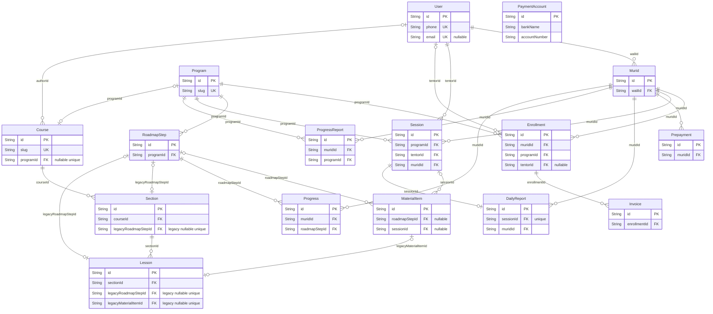

# ERD — LMS Nurman Course

Referensi **16 model yang dideklarasikan** dalam [schema Prisma](../backend/prisma/schema.prisma). Tiga model NC-2 (`Course`, `Section`, `Lesson`) dan migration `nc2_course_section_lesson` baru tersedia secara offline; migration belum diterapkan ke database runtime. Nama model/field mengikuti Prisma; nama tabel mengikuti `@@map`.

## 1. Acuan dan batas pembacaan

- Patokan root: [AGENTS.md](../AGENTS.md) untuk aturan, [SYSTEM_MAP.md](../SYSTEM_MAP.md) untuk peta kode, [README.md](../README.md) untuk pintu masuk, dan [design.md](../design.md) untuk desain.
- [Overview](./CODEBASE_OVERVIEW.md) menjelaskan arsitektur serta konflik dokumentasi root; [flow sistem](./flow-system.md) menjelaskan pemakaian model oleh handler dan portal.
- [Roadmap](./ROADMAP-LMS.md) menyimpan arah produk; [todo](../tasks/todo.md) checklist/status; [plan](../tasks/plan.md) langkah/gate; [progress](./PROGRESS.md) keputusan dan riwayat hasil. Isi tersebut tidak diduplikasi menjadi status implementasi di ERD.
- Datasource bernama `db`, provider `postgresql`; konfigurasi memakai `DATABASE_URL` dan `DIRECT_URL`. Diagram hanya mencakup model aplikasi, bukan schema internal Auth/Storage Supabase.

## 2. Relasi saat ini

`||` = tepat satu; `|o`/`o|` = nol atau satu; `o{` = nol atau banyak. Field `FK` menunjuk `id` model induk. `PaymentAccount` sengaja berdiri sendiri.

## 3. Kamus model

Semua model memiliki `id: String @id @default(uuid())`; schema tidak memberi anotasi `@db.Uuid`. Tabel berikut melengkapi PK/FK pada diagram, bukan menyalin relation-array Prisma. `?` berarti nullable; `[]` berarti array; nilai setelah `=` adalah default schema. Field camelCase yang diberi `@map` menjadi snake_case di database, misalnya `photoPath` → `photo_path`.

### Identitas dan operasional

| Model → tabel | Field skalar selain PK/FK | Makna / default penting |
|---|---|---|
| `User` → `users` | `role: String`, `name: String`, `phone: String`, `email: String?`, `createdAt: DateTime = now()`, `active: Boolean = true`, `address: String?`, `photoPath: String?` | Akun aplikasi; `phone` wajib unik, `email` nullable unik. Tidak menyimpan password. |
| `Murid` → `murids` | `name: String`, `birthDate: DateTime?`, `schoolLevel: String?`, `createdAt: DateTime = now()`, `avatarUrl: String?`, `active: Boolean = true`, `address: String?`, `registeredAt: DateTime = now()`, `photoPath: String?` | Anak milik wali; `registeredAt` memakai `@db.Timestamptz(6)`. |
| `Program` → `programs` | `slug: String`, `name: String`, `description: String`, `category: String`, `basePrice: Float?`, `sessionsPerBlock: Int = 12`, `active: Boolean = true`, `hasRoadmap: Boolean = false` | Program layanan les; `slug` unik. Bukan `Course` pada rencana NC. |
| `Enrollment` → `enrollments` | `status: String`, `startedAt: DateTime = now()` | Hubungan murid–program; penugasan `tentorId` opsional. |
| `Session` → `sessions` | `startsAt: DateTime`, `endsAt: DateTime`, `location: String?`, `status: String` | Pertemuan murid–program–tentor; tidak memiliki `enrollmentId`. |

### Konten dan laporan

| Model → tabel | Field skalar selain PK/FK | Makna / default penting |
|---|---|---|
| `RoadmapStep` → `roadmap_steps` | `order: Int`, `title: String`, `bodyText: String`, `level: String?` | Langkah belajar dalam program. |
| `MaterialItem` → `material_items` | `title: String`, `bodyText: String`, `order: Int` | Dua FK opsional: ke langkah roadmap dan ke sesi; **bukan XOR** pada schema. |
| `DailyReport` → `daily_reports` | `date: DateTime @db.Date`, `startTime: String`, `endTime: String`, `activity: String`, `notes: String?` | `sessionId` unik: satu sesi memiliki paling banyak satu laporan. Jam laporan berupa string, bukan tipe SQL time yang dideklarasikan. |
| `ProgressReport` → `progress_reports` | `blockNumber: Int`, `notes: String?`, `createdAt: DateTime = now()`, `achievements: String[]`, `masteredMaterials: String[]`, `weakMaterials: String[]` | Evaluasi per blok; tiga daftar capaian/materi adalah **array string**, bukan satu kolom teks laporan. |
| `Progress` → `progresses` | `status: String`, `updatedAt: DateTime @updatedAt` | Progres murid pada langkah roadmap; tidak ada composite unique murid–langkah. |

### Konten baru NC-2 (schema offline, belum diterapkan)

| Model → tabel | Field skalar selain PK/FK | Makna / default penting |
|---|---|---|
| `Course` → `courses` | `slug: String @unique`, `title: String`, `description: String`, `level: String?`, `category: String?`, `accessTier: CourseAccessTier?`, `price: Float?`, `status: ContentStatus = draft`, `publishedAt: DateTime?`, `authorId: String?`, `programId: String? @unique`, `active: Boolean = true`, `createdAt/updatedAt` | Konten course baru. `authorId` nullable untuk hasil migrasi; `programId` menautkan ke Program legacy satu-satu (nullable), bukan rename Program. |
| `Section` → `sections` | `legacyRoadmapStepId: String? @unique`, `order: Int`, `title: String`, `level: String?`, `summary: String?`, `createdAt/updatedAt` | Satu section per roadmap step legacy untuk backfill idempoten; unique `(courseId, order)`. |
| `Lesson` → `lessons` | `legacyRoadmapStepId: String? @unique`, `legacyMaterialItemId: String? @unique`, `slug: String @unique`, `title`, `summary?`, `bodyText: String`, `visibility: LessonVisibility = entitled`, `status: ContentStatus = draft`, `publishedAt?`, `order: Int`, `estimatedMinutes: Int?`, `createdAt/updatedAt` | bodyText intro roadmap pada `legacyRoadmapStepId`; materi pada `legacyMaterialItemId`. Unique `(sectionId, order)`. |

### Pembayaran

| Model → tabel | Field skalar selain PK/FK | Makna / default penting |
|---|---|---|
| `Invoice` → `invoices` | `amount: Float`, `status: String`, `dueAt: DateTime`, `paidAt: DateTime?`, `note: String?`, `paymentNote: String?`, `createdAt: DateTime = now()`, `paymentProof: String?`, `paymentProofName: String?`, `paidAmount: Float?`, `submittedAt: DateTime?` | Tagihan enrollment; `note` tagihan terpisah dari `paymentNote` pengirim bukti. |
| `Prepayment` → `prepayments` | `amount: Float`, `status: String`, `note: String?`, `createdAt: DateTime = now()`, `paymentProof: String?`, `paymentProofName: String?`, `submittedAt: DateTime?`, `paidAt: DateTime?` | Pembayaran mandiri milik murid, tanpa FK invoice/enrollment/program. Bukan ledger saldo otomatis. |
| `PaymentAccount` → `payment_accounts` | `bankName: String`, `accountNumber: String`, `accountName: String`, `isActive: Boolean = true`, `isDefault: Boolean = false`, `note: String?`, `createdAt: DateTime = now()` | Rekening tujuan transfer; tidak direlasikan ke Invoice/Prepayment dan tidak ada unique pada nomor rekening/default. |

## 4. Constraint database versus aturan aplikasi

- Selain PK, field legacy yang memakai `@unique` adalah `User.phone`, `User.email`, `Program.slug`, dan `DailyReport.sessionId`. Schema NC-2 menambah unique `Course.slug`, `Course.programId`, lineage legacy Section/Lesson, `Lesson.slug`, serta composite order `(courseId, order)` dan `(sectionId, order)`; `Enrollment`/`Progress` lama tetap tidak punya composite unique.
- `Murid.waliId` **tidak unik**, sehingga relasi DB wali–murid adalah 1:N. Namun `POST /api/admin/murids` menolak `409` bila wali sudah memiliki **murid apa pun**, tanpa filter `active`. Selector anak di UI tidak berarti pendaftaran multi-anak sudah didukung API.
- Duplikasi enrollment aktif murid–program ditolak handler dengan pencarian `status: active`, bukan constraint unik database.
- FK ke `User` memastikan keberadaan user, bukan nilai `role`. Penamaan relasi `WaliToMurids`, `TentorToSessions`, dan `TentorToEnrollments` tidak menjadi pembatas role SQL.
- `MaterialItem.roadmapStepId` dan `sessionId` keduanya nullable: schema tidak memaksa tepat satu terisi; keduanya kosong atau keduanya terisi tidak dilarang oleh constraint yang dideklarasikan. Shared input admin mewajibkan `roadmapStepId`, tetapi itu kontrak aplikasi yang lebih sempit.
- `DailyReport` memiliki FK murid dan sesi terpisah; kesamaan murid laporan dengan murid sesi berasal dari handler, bukan constraint lintas kedua FK tersebut.
- Nilai uang (`basePrice`, `amount`, `paidAmount`) memakai **Float**, bukan Decimal/integer minor units. Positif/nonnegatif dan transisi status diperiksa aplikasi, bukan validasi nominal yang dideklarasikan di schema.
- Role/kategori/status domain legacy tetap `String`. NC-2 menambah PostgreSQL enum `CourseAccessTier` (`free/paid`), `ContentStatus` (`draft/published`), dan `LessonVisibility` (`public/entitled`); `Course.accessTier` nullable selama draft dan divalidasi sebelum publish.

## 5. Penghapusan, identitas, dan privasi

Schema sekarang mendeklarasikan **22 relasi FK** setelah tambahan NC-2. Relasi legacy umumnya `onDelete: Cascade`, kecuali `Enrollment.tentor`, `Course.author`, dan `Course.program` memakai `SetNull`; `Section.course` serta `Lesson.section` memakai Cascade. Migration NC-2 belum diterapkan ke runtime. Pada domain legacy, hapus murid dapat menghapus enrollment, invoice turunannya, sesi, laporan, progres, dan prabayar. Hapus tentor menghapus sesi miliknya, tetapi mengosongkan penugasan tentor pada enrollment. `active=false` adalah perubahan field aplikasi, bukan pemicu cascade.

`User` memetakan tabel aplikasi `users`, bukan `auth.users`. Handler pembuatan akun menyamakan `User.id` dengan ID yang dikembalikan Supabase Auth, tetapi **schema ini tidak mendeklarasikan FK dari public User ke `auth.users`** atau trigger sinkronisasi. Kesetaraan identitas adalah tanggung jawab aplikasi. Backend NC-1.4 lokal membaca akun dan profil hanya berdasarkan verified Auth ID, tanpa fallback email. Middleware/profil memvalidasi `active === true` dan role melalui shared schema; ini guard aplikasi, bukan constraint SQL atau bukti data legacy telah direkonsiliasi. Gate merge/rollout tetap blocked sampai admin memastikan kegunaan lima Auth tanpa profil dan menyetujui dampak/rekonsiliasi; audit/verifikasi terpusat di [PROGRESS](./PROGRESS.md#backend-part2-20260916).

Foto pada `photoPath` dan bukti pada `paymentProof` dipakai sebagai string/data URL base64 oleh alur aplikasi. Nama `photoPath` bukan bukti penyimpanan file di bucket. Tidak ada model Storage atau relasi objek media di ERD; private Storage/signed URL bukan alur yang sudah selesai. Base64 bukan enkripsi atau jaminan privasi, dan dokumen ini tidak menetapkan bucket publik untuk foto/bukti.

## 6. Rencana nCourse — status implementasi terbaru

Acuan: [keputusan D1–D16](./PROGRESS.md#keputusan-ncourse) dan [roadmap](./ROADMAP-LMS.md). `Course`/`Section`/`Lesson` sudah ada sebagai schema+migration SQL offline (belum `migrate deploy`); tabel di bawah menandai bagian yang masih rencana murni.

| Area target | Status |
|---|---|
| `Course → Section → Lesson` | Schema offline tersedia (bagian 2 di atas); migration belum diterapkan ke database, backfill nyata dan drop legacy masih blocked izin DB. |
| `Program` dan `Course` | D16 dipertahankan: `Course.programId` nullable unique, Program tidak diubah. |
| `Entitlement` | Target akses konten melekat pada `User`, bukan `Murid`; belum ada model/relasinya saat ini. |
| Role dari DB (D5), pembeda dari target schema | Sudah diterapkan **lokal** pada backend NC-1.4, tanpa perubahan schema; frontend masih metadata. Bukan bukti deployment atau perubahan role UI; lihat [flow auth](./flow-system.md#4-login-identitas-dan-otorisasi-aktual). |
| Penghapusan `MaterialItem.sessionId` | Belum diterapkan: field masih ada, dan [seed](../backend/prisma/seed.ts) masih membuat material berbasis sesi. Frasa historis “baru dibuang” bukan bukti penghapusan. |

Klaim lama “belum ada DB/LMS” di root dan ERD konseptual Fase 0 tidak menggantikan schema ini. Detail kontrak pembayaran dan batas UI/API ada di [flow sistem](./flow-system.md); kondisi server/DB aktif tetap di luar cakupan referensi source ini.
