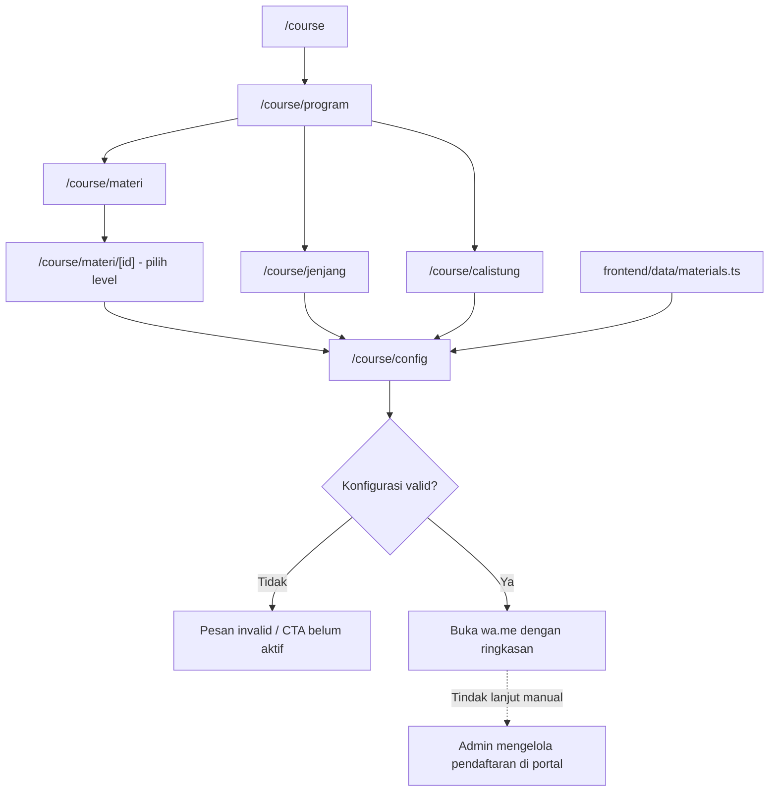
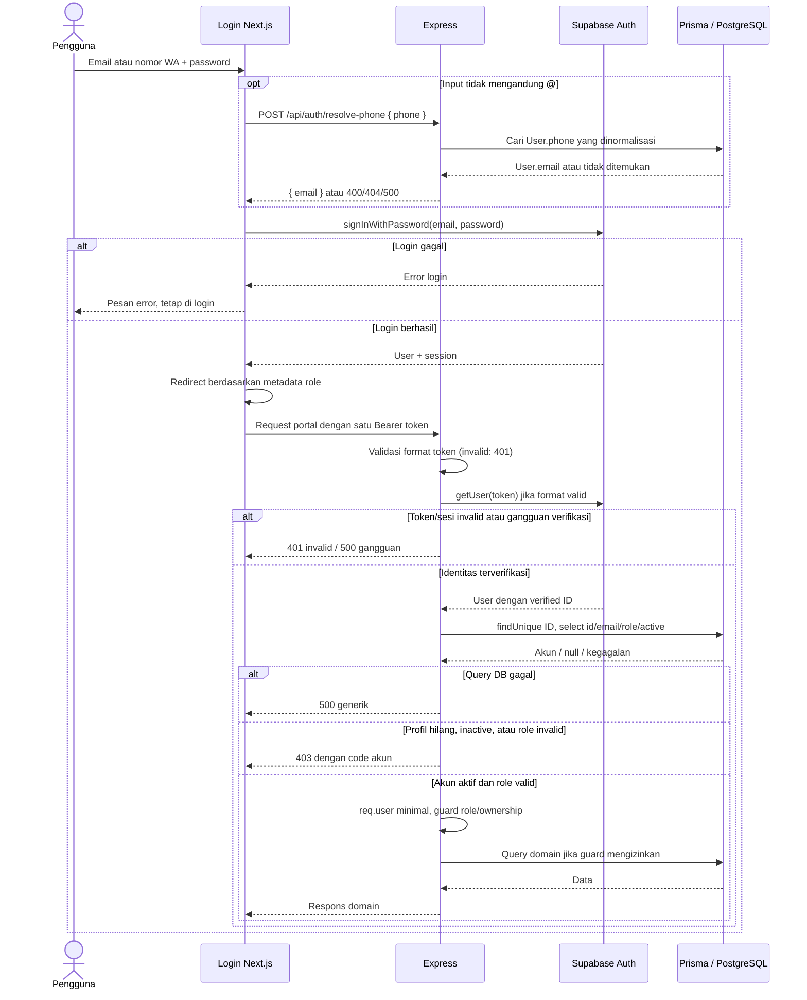

# Flow Sistem — Nurman Course

Referensi alur yang tersedia di source: **funnel WhatsApp** dan **portal operasional wali, tentor, admin**. Dokumen ini bukan checklist, log sesi, atau klaim keberhasilan runtime end-to-end. Model data dijelaskan di [ERD](./erd-lms.md), arsitektur/modul di [overview](./CODEBASE_OVERVIEW.md).

## 1. Acuan dan batas sistem

| Acuan | Peran |
|---|---|
| [AGENTS.md](../AGENTS.md), [SYSTEM_MAP.md](../SYSTEM_MAP.md) | Patokan aturan kerja dan peta kode; klaim implementasi yang konflik mengikuti source. |
| [README.md](../README.md), [design.md](../design.md) | Pintu masuk repo / referensi desain root; bukan bukti kontrak API atau deployment. |
| [ROADMAP-LMS.md](./ROADMAP-LMS.md) | Visi dan fase, termasuk arah NC; bukan daftar fitur yang sudah berjalan. |
| [todo](../tasks/todo.md), [plan](../tasks/plan.md), [progress](./PROGRESS.md) | Checklist/status, langkah/gate, serta keputusan/riwayat hasil; tidak dicampur ke alur ini. |

Bagian akhir AGENTS yang menyatakan tanpa backend/DB/auth/LMS adalah baseline lama; Express, Prisma, dan portal sudah ada. README masih boilerplate, sedangkan `design.md` tidak menggambarkan seluruh UI terbaru. Konflik root dicatat lebih lengkap di overview; root tidak diubah oleh referensi ini.

## 2. Entry publik dan funnel pendaftaran

`/` melakukan redirect ke `/landing` (marketing). `/course` tetap entry funnel tersendiri dengan CTA ke `/course/program`.



- List/detail memakai katalog statis `materials.ts`, bukan tabel `Program`. Query ke config: `materi`, `level`, serta `program=calistung` untuk paket calistung; jenjang/calistung memakai `level=1`.
- `CourseConfigClient` menghitung estimasi per anak per minggu dari harga level, durasi, frekuensi, diskon peserta, dan biaya lokasi. State form lokal; config bukan checkout dan tidak membuat User, Enrollment, Invoice, atau Session di DB.
- CTA memerlukan materi/level valid, seluruh nama peserta, sedikitnya satu hari, jam, dan lokasi rumah siswa. Jumlah hari dibatasi maksimum frekuensi, tidak diwajibkan sama persis. Materi/level invalid menampilkan pesan konfigurasi tidak valid.
- Calistung memakai label **Program** dan menyembunyikan level pada ringkasan UI maupun pesan WA. Slot “Full” berasal dari konstanta config, bukan kapasitas jadwal live; sesi dua jam dan tempat tentor masih `comingSoon`.
- URL `wa.me` berisi pesan ter-encode untuk dibuka pengguna; tidak ada pengiriman WhatsApp server-side ataupun sinkronisasi otomatis funnel → database.

Sumber: [config funnel](../frontend/app/course/config/CourseConfigClient.tsx), [data funnel](../frontend/data/materials.ts), dan route di `frontend/app/course/`.

## 3. Admin: akun, murid, dan enrollment

Semua endpoint admin di bawah memakai `requireAuth` + `requireAdmin`. Akun login adalah `User`; anak adalah `Murid`, bukan akun login mandiri.

| Langkah | Kontrak backend saat ini |
|---|---|
| Buat tentor/wali | `POST /api/admin/users`: validasi shared schema, buat Supabase Auth user, lalu Prisma User dengan ID yang sama. Email kosong diganti placeholder `phone@nurmancourse.local`; respons `201 { data, temporaryPassword }`. Role input hanya `tentor/wali`. |
| Buat murid beserta wali | `POST /api/admin/murids`: normalisasi nomor, cari User berdasarkan phone; tolak nomor milik non-wali. Jika wali belum ada, buat Auth + User, lalu Murid. Respons `201 { data, waliCreated, defaultPassword? }`. |
| Reuse wali | Hanya dapat dilanjutkan bila wali tersebut belum punya murid. Handler menolak `409` jika ada **murid apa pun** dengan `waliId` tersebut, **tanpa filter active**. |
| Daftarkan ke program | `POST /api/admin/enrollments`: murid/program harus ada dan aktif; tentor opsional harus user ber-role tentor. Duplikasi enrollment aktif murid–program ditolak `409`; sukses membuat status `active`, respons `201 { data }`. |

Schema DB memungkinkan wali 1:N murid, dan beberapa halaman dapat memilih anak dari data yang sudah ada. Itu **bukan** dukungan pembuatan multi-anak melalui API sekarang. Tidak boleh melonggarkan batas ini hanya berdasarkan selector UI.

Pembuatan akun melintasi Auth dan DB, bukan satu transaksi atomik: kegagalan membuat profil User mencoba menghapus Auth user yang baru dibuat. Kegagalan membuat Murid setelah profil berhasil tidak memiliki rollback penuh seluruh rangkaian pada handler tersebut. Kredensial sementara diserahkan melalui proses admin, bukan signup publik di `/login`.

## 4. Login, identitas, dan otorisasi aktual



- **Backend NC-1.4 lokal:** `requireAuth` menerima format strict `Bearer <token>` (satu spasi, satu token non-whitespace), lalu `supabase.auth.getUser(token)` memverifikasi ID. Prisma `user.findUnique` hanya mencari ID itu dengan `select: { id, email, role, active }`; role divalidasi shared `userRoleSchema` (`admin/tentor/wali`). `req.user` hanya berisi verified ID, email DB opsional, dan role tervalidasi. Tidak memakai metadata, default wali, atau cache privilege.
- `validateAccountAccess` dipakai middleware dan profil dengan urutan: profil hilang → `PROFILE_NOT_FOUND`; `active !== true` → `ACCOUNT_INACTIVE`; role invalid → `INVALID_ROLE`. Seluruhnya `403 { error: { code, message } }`. Pesan inactive meminta daftar ulang/hubungi admin; email/nomor yang sama memerlukan persetujuan admin, bukan reaktivasi/provisioning/relink otomatis.
- `requireRole(...roles)` adalah allowlist, menolak `req.user` hilang atau role di luar daftar dengan `403 FORBIDDEN`. `requireAdmin = requireRole("admin")` mempertahankan pesan `Admin access is required`; daftar selain admin tunggal memakai `Access is not allowed for this role`.
- **`GET /api/users/me`:** request tanpa body, header `Authorization: Bearer <token>`, melalui `requireAuth`, lalu query ID-only kedua dengan `include: { murids: true }`. Hasil kedua divalidasi lagi sehingga profil yang hilang/nonaktif/role invalid setelah gate pertama tetap ditolak. Sukses tetap `200 { user }` (profil DB beserta `murids`); tidak ada fallback email, dan profil hilang kini `403`, bukan `404` historis.

| Kondisi auth/profil | Respons |
|---|---|
| Header hilang atau format token salah | `401 { "error": "Unauthorized: Missing or invalid token format" }` |
| SDK mengembalikan error status 400/401/403 atau tidak ada user tanpa gangguan SDK | `401 { "error": "Unauthorized: Invalid or expired session token" }` |
| SDK mengembalikan error status lain/tanpa status, melempar exception (termasuk status 400/401/403), atau query auth DB gagal | `500 { "error": "Internal server error during authentication" }` |
| Profil hilang pada salah satu pembacaan | `403 { "error": { "code": "PROFILE_NOT_FOUND", "message": "Profil akun tidak ditemukan. Hubungi admin." } }` |
| Query profil kedua gagal | `500 { "error": "Internal server error" }` |

Middleware/profil hanya mencatat pesan log generik, bukan raw error. **Frontend belum berubah:** `updateSession` memanggil `getUser()`; middleware route/login masih memakai metadata role dan fallback wali. D5 sudah diterapkan **lokal pada backend**, bukan bukti role UI benar atau deployment selesai.

**Merge/rollout BLOCKED** sampai admin memastikan kegunaan lima Auth tanpa profil dan menyetujui dampak/rekonsiliasi; menghapus fallback backend tidak merekonsiliasi data legacy. Audit staging/development dan hasil verifikasi hanya dirujuk di [PROGRESS](./PROGRESS.md#backend-part2-20260916). Tidak ada mutasi remote, frontend/browser/login/session test, commit/push/deploy dalam scope ini.

Sumber: [auth backend](../backend/src/middleware/auth.ts), [handler profil](../backend/src/index.ts), [shared role schema](../packages/shared/src/index.ts), [login](../frontend/app/login/page.tsx), [middleware frontend](../frontend/middleware.ts), dan [session frontend](../frontend/lib/supabase/middleware.ts).

## 5. Navigasi portal

| Role / area | Route dan alur |
|---|---|
| Wali | Login → `/app/dashboard`; navigasi `/app/program`, `/app/program/[slug]`, `/app/jadwal`, `/app/laporan`, `/app/tagihan`, `/app/profile`. Middleware mengalihkan akses `/app`, admin, atau tentor kembali ke dashboard wali. |
| Tentor | Login → `/app/tentor` → redirect `/app/tentor/dashboard`; menu `/app/tentor/jadwal`, `/app/tentor/laporan-harian`, `/app/tentor/laporan-perkembangan`, `/app/tentor/profil`. Akses di luar area tentor dialihkan ke dashboard tentor. |
| Admin | Login → `/app/admin`; menu `/murid`, `/tentor`, `/program`, `/enrollment`, `/roadmap`, `/jadwal`, `/tagihan`, `/rekening` di bawah prefiks `/app/admin`. Detail invoice: `/app/admin/tagihan/[invoiceId]`. Admin tidak dibatasi redirect role portal tersebut. |
| Selector / alias | `/app` berisi selector portal, tetapi wali/tentor dialihkan middleware. `/app/materi` **redirect ke `/app/program`**, bukan katalog terpisah seperti uraian lama SYSTEM_MAP. |

Folder route group `(wali)` tidak muncul di URL. `/app/admin/pengguna` tidak memiliki `page.tsx`; jangan mendokumentasikannya sebagai halaman manajemen user aktif.

Di detail program wali, frontend mencocokkan slug dari `GET /api/programs`. Belum enrolled: outline dan CTA daftar lewat WA; sudah enrolled aktif: roadmap/progres murid. Backend detail program memakai **ID** (`GET /api/programs/:id`), bukan slug. Kedua endpoint program publik menyertakan `RoadmapStep.bodyText`; penguncian langkah di UI bukan proteksi konten oleh backend.

## 6. Jadwal dan laporan belajar

1. **Jadwal:** admin membuat sesi melalui `POST /api/admin/sessions`, tentor melalui `POST /api/me/sessions`. Input berisi enrollment, tanggal, jam, lokasi; handler mengambil murid/program/tentor dari penugasan dan membentuk timestamp `+07:00`. Tentor harus memiliki enrollment aktif tersebut; sesi baru berstatus `scheduled`. Schema Session tidak menyimpan FK enrollment.
2. **Validasi/perubahan:** create menolak jam akhir tidak setelah jam awal; overlap sesi non-cancelled untuk murid **atau** tentor ditolak `409`. PATCH juga mengecek overlap saat waktu berubah. Sesi completed tidak bisa diedit/dihapus lewat handler jadwal; laporan menghalangi pembatalan/penghapusan. Admin create mengasumsikan `enrollment.tentorId` terisi, belum memiliki guard khusus untuk penugasan null.
3. **Laporan harian:** `POST /api/daily-reports` khusus tentor pemilik sesi, payload `{ sessionId, activity, notes }`. Backend upsert berdasarkan `sessionId`, mengambil murid/tanggal dari Session serta jam Session saat create, lalu mengubah status sesi menjadi `completed`. Form menampilkan tanggal/jam, tetapi submit tidak mengirim perubahan kedua nilai tersebut. Upsert dan update sesi adalah operasi terpisah, bukan transaksi tunggal.
4. **Laporan perkembangan:** dashboard tentor mendeteksi blok completed berdasarkan `sessionsPerBlock` yang belum punya rapor. `POST /api/progress-reports` menerima murid/program/blok dan tiga array capaian/materi; handler memastikan ada sesi tentor pada pasangan murid/program, lalu **create**, bukan upsert. Ambang jumlah sesi dan keunikan blok tidak ditegakkan handler/schema. Wali membaca laporan lewat API; tersimpan tidak berarti langsung tersinkron lintas browser.

Sumber: [handler Express](../backend/src/index.ts), [laporan harian UI](../frontend/app/app/tentor/laporan-harian/LaporanHarianClient.tsx), [dashboard tentor](../frontend/app/app/tentor/dashboard/page.tsx). Pembaruan laporan lama menggunakan mode edit; jangan menyimpulkan semua input UI menjadi field yang disimpan.

## 7. Tagihan dan prabayar — kontrak backend

Pembayaran tetap transfer/manual. `PaymentAccount` berisi rekening tujuan; `GET /api/payment-accounts` **memerlukan auth** dan mengembalikan rekening aktif. Pencatatan invoice/prabayar bukan payment gateway atau top-up kuota otomatis.

| Operasi | Input / respons utama | Perubahan dan batas |
|---|---|---|
| `POST /api/admin/invoices` | `{ enrollmentId, amount, dueAt, note? }` → `201 { data }` | Enrollment harus aktif; invoice dibuat `unpaid`. |
| `POST /api/me/invoices/:id/payment` | `{ proofBase64, proofName?, amount?, note? }` → `200 { data }` | Wali pemilik invoice, hanya `unpaid → waiting`; simpan bukti, nama file, `paidAmount`, `paymentNote`, `submittedAt`. Amount kosong memakai nominal invoice. |
| `PATCH /api/admin/invoices/:id/status` | `{ status }` → `200 { data }` | `unpaid → unpaid/waiting/paid`; `waiting → waiting/unpaid/paid`; `paid → paid/unpaid`. `paid → waiting` ditolak `400 INVALID_TRANSITION`. |
| `POST /api/me/prepayments` | `{ muridId, amount, proofBase64, proofName?, note? }` → `201 { data }` | Wali pemilik murid; membuat Prepayment `waiting`, tanpa invoice/enrollment. |
| `PATCH /api/admin/prepayments/:id/status` | `{ status: waiting/paid/cancelled }` → `200 { data }` | Tidak ada matriks transisi asal–tujuan seperti invoice. `paidAt` diisi saat paid, tidak dibersihkan ketika kembali waiting/cancelled. |

Pada perubahan status invoice, `paidAt` selalu diisi waktu sekarang untuk `paid`, selain itu `null`; meminta `paid` lagi juga memperbarui waktu tersebut. Admin dapat menandai paid tanpa bukti melalui endpoint status. Tidak ada status invoice `cancelled` pada kontrak shared; pembatalan prabayar adalah domain berbeda.

Contoh **payload backend**, bukan payload UI saat ini (bukti disingkat):
```json
{ "proofBase64": "data:image/png;base64,<isi-bukti>", "proofName": "transfer.png", "amount": 150000, "note": "Pembayaran les" }
```
Respons invoice-payment memuat `{ "data": { ...fieldInvoice } }`. Validasi body `400`, role/ownership `403`, objek tidak ditemukan `404`, dan invoice bukan unpaid `409`; token tidak sah ditolak `401` sebelum handler. Format error pembayaran berbentuk `{ "error": { "code": "...", "message": "...", "details": {} } }`, dengan `details` hanya pada sebagian error validasi.

## 8. Batas integrasi pembayaran dan privasi

**Source UI/API belum cocok; keberhasilan submit runtime belum diverifikasi.** [Halaman tagihan wali](../frontend/app/app/(wali)/tagihan/page.tsx) mengirim `paymentProof`/`paymentProofName` (invoice juga `paymentNote`), sedangkan [shared schemas](../packages/shared/src/index.ts) dan backend membaca `proofBase64`/`proofName`/`note`. `apiFetch` meneruskan body tanpa pemetaan nama. Kedua submit tidak memenuhi field wajib `proofBase64`; secara kontrak akan ditolak validasi bila mencapai handler tersebut. Ini temuan source, bukan hasil uji request live.

Foto/bukti menggunakan string/data URL base64; invoice image diproses client, PDF/prabayar dibaca melalui FileReader. Ini bukan upload ke public Storage dan base64 bukan enkripsi. Private bucket/signed URL belum menjadi alur selesai. UI menampilkan batas file, tetapi backend memakai `express.json` dengan batas default **100kb** dan menolak payload lebih besar melalui `413 PAYLOAD_TOO_LARGE`: label UI bukan jaminan payload diterima server. Ukuran file yang didukung belum diputuskan, sehingga batas ini belum dinaikkan (NC-1.5-PAYLOAD).

WhatsApp tetap channel pendaftaran/diskusi, bukan pemicu status paid. Uraian lama “unggah lalu konfirmasi WA” tidak menggantikan kontrak submit bukti → verifikasi admin di atas. UI prabayar juga memuat copy invoice otomatis/top-up kuota; handler yang diperiksa hanya mencatat Prepayment, tidak menerbitkan invoice atau mengalokasikan kuota.

## 9. Pembacaan data dan rencana terpisah

Portal memanggil [apiFetch](../frontend/lib/api.ts) → Express → Prisma → PostgreSQL. GET memakai memory cache satu jam berkunci path; `bypassCache` melewati cache. Non-GET menginvalidasi kategori cache sebelum request, bukan seluruh relasi bisnis atau browser pengguna lain. Respons berbeda antar domain (`{ user }`, `{ reports }`, `{ invoices }`, `{ data }`); error legacy juga dapat berupa string. Karena itu, tidak ada janji pembaruan data realtime dari alur ini.

Target NC di [keputusan D1–D16](./PROGRESS.md#keputusan-ncourse): Opsi A dual surface, konten `Course → Section → Lesson`, dan akses `Entitlement` pada User. **Program tetap dipertahankan** untuk layanan bertentor (D16), bukan diganti total oleh Course. Role dari DB sudah diterapkan lokal pada backend NC-1.4 dengan gate rollout di §4; role member, route publik `/kelas`/`/materi/[slug]`, dan pemeriksaan entitlement tetap bukan flow saat ini. `MaterialItem.sessionId` juga masih ada pada schema/seed; rencana penghapusannya bukan pekerjaan yang sudah terjadi.

Rujukan ini terbatas pada source lokal. Status DB aktif, akses akun nyata, keberhasilan submit, dan render seluruh portal tidak dinyatakan terverifikasi oleh dokumentasi.
